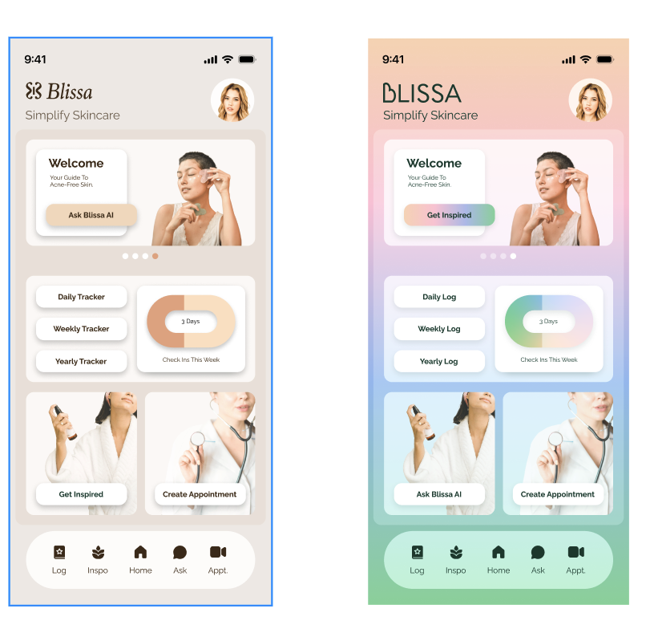
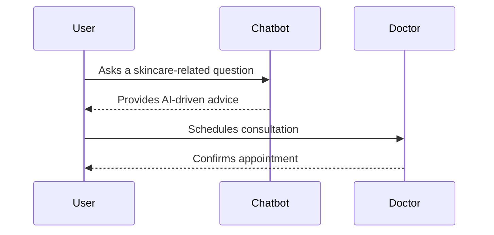

# Blissa

the Final MVP for Blissa//
Rubric copyed from StartUP project 1 and 2 // the original one was call BestNow

# Blissa

## Specification Deliverable

### Elevator pitch

At Blissa, we simplify skincare by connecting users with professionals and delivering personalized skincare advice. Our platform features an intelligent chatbot, real-time appointment scheduling, and health progress tracking. With a seamless login system and secure cloud hosting, users can easily manage their skincare journey and consult with trusted professionals anytime.

### Design

Here is a sequence diagram that shows how to people would interact with the backend to vote.

### Key features

    •	User Authentication
    •	Secure registration and login using MongoDB.
    •	Google OAuth for faster sign-in.
    •	Skincare Chatbot
    •	Provides personalized skincare advice using AI.
    •	Responds to queries in real time.
    •	Consultation Scheduling
    •	Allows users to book appointments with professionals.
    •	Progress Tracking
    •	Daily, weekly, and yearly logs to monitor skincare habits.
    •	Responsive UI
    •	User-friendly design with Vite and React for cross-platform usability.

### Technologies

I am going to use the required technologies in the following ways.

- **HTML** - Uses correct HTML structure for application. Start with three HTML pages. One for login and one for write reviews, and one for displaying reviews.
- **CSS** - Application styling that looks good on different screen sizes, uses good whitespace, color choice and contrast.
- **React** - Provides login, choice display, display the product reviews data from different site, and use of React for routing and components.
- **Service** - Backend service with endpoints for:
  - login
  - retrieving review data
  - submitting new reviews
- **DB/Login** - Store users, people's reviews in database. Register and login users. Credentials securely stored in database. Can't review a product unless authenticated.
- **WebSocket** - As each review got liked, the like count will be updated in real time.

## HTML deliverable

➡️ The following is an example of the required information for the `Startup HTML` deliverable

- [x] **HTML pages** - Lots of HTML page that represent the ability to login and display reviews and write reviews.
- [x] **Links** - The login page automatically links to the Home page(home page contains product review products). The Home page has a link to the write review page.
- [x] **Text** - The login page has a login form. The Home page has a list of products with reviews. The write review page has a form to write a review.
- [x] **Images** - Images will be added for represent the products.
- [x] **DB/Login** - Input box and submit button for login. Review form for write review page.
- [x] **WebSocket** - The review count will be updated in real time. People will receive notification when a new comments or like is added to his post.

## CSS deliverable

➡️ The following is an example of the required information for the `Startup CSS` deliverable

- [x] **Header, footer, and main content body**
- [x] **Navigation elements** -
- [x] **Responsive to window resizing** -
- [x] **Application elements** -
- [x] **Application text content** -
- [x] **Application images** -

## React deliverable

➡️ The following is an example of the required information for the `Startup React` deliverable

- [ ] **Bundled and transpiled** -
- [ ] **Components** -
  - [ ] **login** -
  - [ ] **database** -
  - [ ] **WebSocket** -
  - [ ] **application logic** -
- [ ] **Router** -
- [ ] **Hooks** -

## Service deliverable

➡️ The following is an example of the required information for the `Startup Service` deliverable

- [ ] **Node.js/Express HTTP service** -
- [ ] **Static middleware for frontend** -
- [ ] **Calls to third party endpoints** -
- [ ] **Backend service endpoints** -
- [ ] **Frontend calls service endpoints** -

## DB/Login deliverable

➡️ The following is an example of the required information for the `Startup DB/Login` deliverable

- [ ] **MongoDB Atlas database created** -
- [ ] **Stores data in MongoDB** -
- [ ] **User registration** -
- [ ] **existing user** -
- [ ] **Use MongoDB to store credentials** -
- [ ] **Restricts functionality** -

## WebSocket deliverable

➡️ The following is an example of the required information for the `Startup WebSocket` deliverable

- [ ] **Backend listens for WebSocket connection** -
- [ ] **Frontend makes WebSocket connection** -
- [ ] **Data sent over WebSocket connection** -
- [ ] **WebSocket data displayed** -

## Notes

For more details on what I learned, check out my [notes.md](./notes.md).
